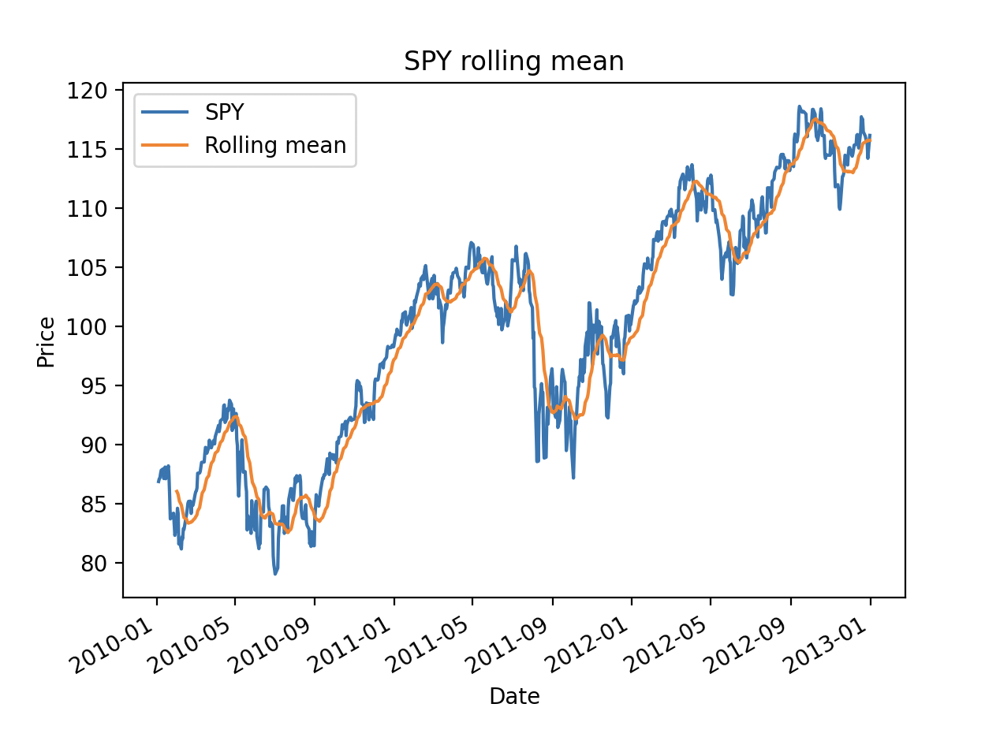
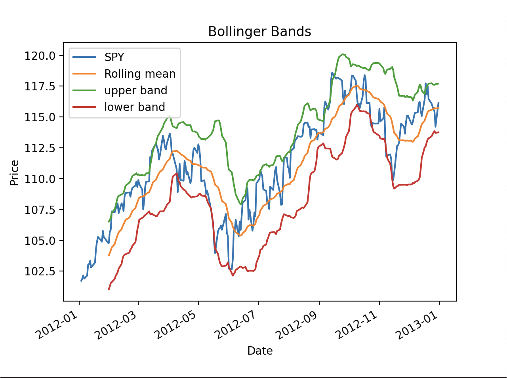

# Statistical Analysis of Time Series

## Script to run stat analysis

Run the script _compute-global-stats.py_.

### How to run (with example)

1. `cd` into this subdirectory
2. Run `pipenv install <LIBRARY>` to install script dependencies
3. Run `pipenv run python compute-global-stats.py` to run script

## Statistical Analysis Terms

### Rolling Mean

The **Rolling Mean** is the moving average over a window of time.

### Bollinger Bands

The **Bollinger Bands** help know if the deviation from the rolling mean is significant enough for a trading signal.

You create two curves, one that's two standard devs ABOVE the rolling mean, and another that's two standards BELOW.

If the stock price intersects with the

- BELOW curve, it's the best time to buy
- ABOVE curve, it's the best time to sell

  
