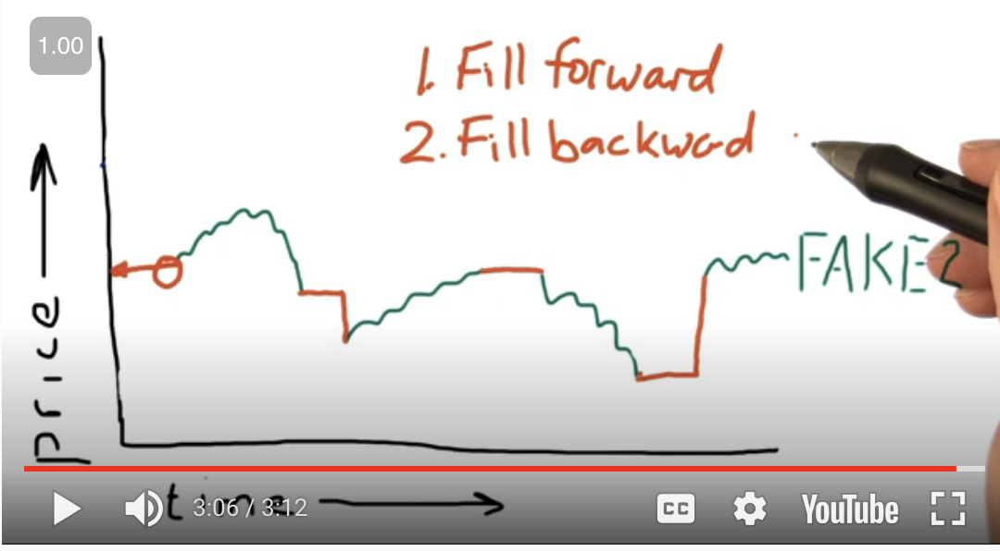

# Incomplete Data

The data isn't perfect because the stock data can be from many resources. Data can go missing for many reasons.

Examples:

1. Company gets acquired
2. Ticker changes

To deal with the missing data, you have to FILL FORWARD, then FILL BACKWARD to reduce peeking into the future.

## Script to deal with missing data

Run the script _fill-missing-values.py_.

FAKE1 requires a FILL BACKWARD

### How to run (with example)

1. `cd` into this subdirectory
2. Run `pipenv install <LIBRARY>` to install script dependencies
3. Run `pipenv run python fill-missing-values.py` to run script

## Read CSV

To read the CSV file, use the _read-csv.py_ and the stock data file _JAVA.csv_ (downloaded from [JAVA data history](https://finance.yahoo.com/quote/JAVA/history)).
