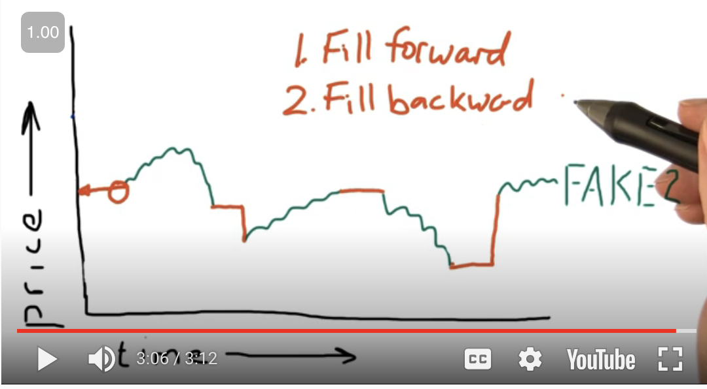

# Incomplete Data

Stock data often has missing values (NaN) for various reasons:
- Companies getting acquired
- Ticker symbol changes
- Data source gaps
- Non-trading days for specific stocks

## Handling Missing Data

The proper strategy is a **two-step fill**:

1. **Forward fill (`ffill`)** - Propagate the last known value forward
2. **Backward fill (`bfill`)** - Fill any remaining gaps at the beginning with the next known value

This order is critical: forward-filling first avoids "peeking into the future" since you're only using historical data. Backward fill only catches gaps at the very start of the dataset where no previous value exists.

## Script

[fill-missing-values.py](fill-missing-values.py) demonstrates this technique using:
- **ORCL** (Oracle) - real stock data as reference
- **FAKE1** - has missing data at the start (requires backward fill)
- **FAKE2** - has missing data in the middle (requires forward fill)

### How to Run

1. `cd` into this subdirectory
2. Run `uv sync` to install dependencies
3. Run `uv run fill-missing-values.py` to run script

The output plot shows how both synthetic datasets get properly filled to align with ORCL's trading calendar.
