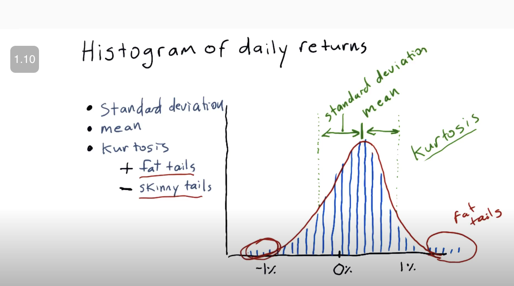

# Histograms and Scatter Plots

Learn about _kurtosis_, the tailness of distributions with histograms of daily returns.

- = fat tails

* = skinny tails
  

## Script to run create histograms and scatter plots

Run the script _compute-global-stats.py_.

### How to run (with example)

1. `cd` into this subdirectory
2. Run `pipenv install <LIBRARY>` to install script dependencies
3. Run `pipenv run python compute-global-stats.py` to run script
