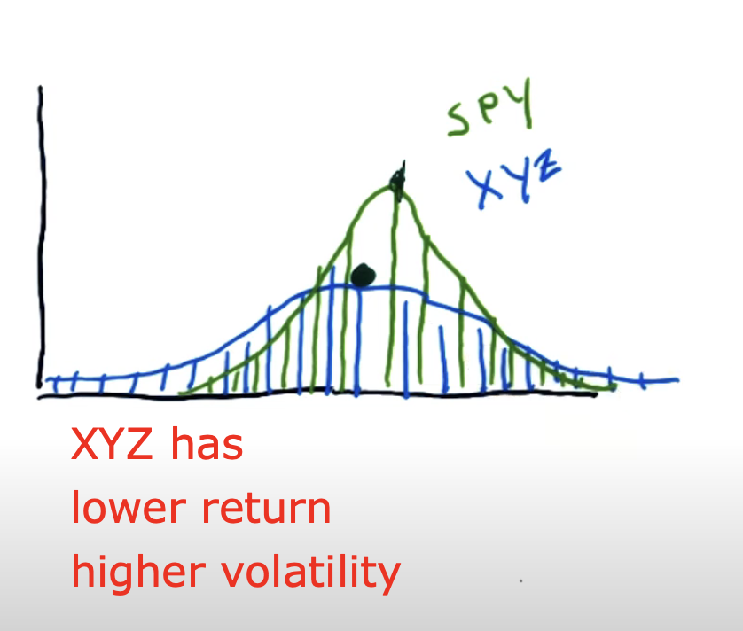
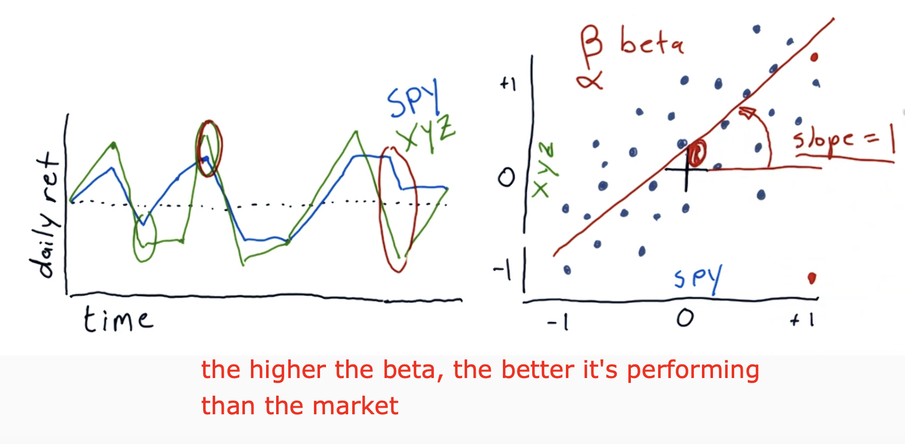

# Histograms and Scatter Plots

Learn about _kurtosis_, the tailness of distributions with histograms of daily returns.

When Kurtosis is positive or negative...

- = fat tails

* = skinny tails
  

Interpreting Histograms...

- XYZ has lower mean than SPY meaning lower return
- XYZ has broader shoulders or larger standard deviations than SPY meaning higher volatility
  

Interpreting Scatter plots...

- Beta (the slope) shows how reactive is the stock to the market. For example, on average...
  - If Beta is one, then if the market goes up 1%, the stock goes up 1%
  - If Beta is two, then if the market goes up 1%, the stock goes up 1%
- Alpha (vertical line intercepts the vertical axis) if positive, means on average, the stock is performing better than the market.

## Script to run create histograms and scatter plots

Run the script _plot-histograms.py_.

### How to run (with example)

1. `cd` into this subdirectory
2. Run `pipenv install <LIBRARY>` to install script dependencies
3. Run `pipenv run python plot-histograms.py` to run script
