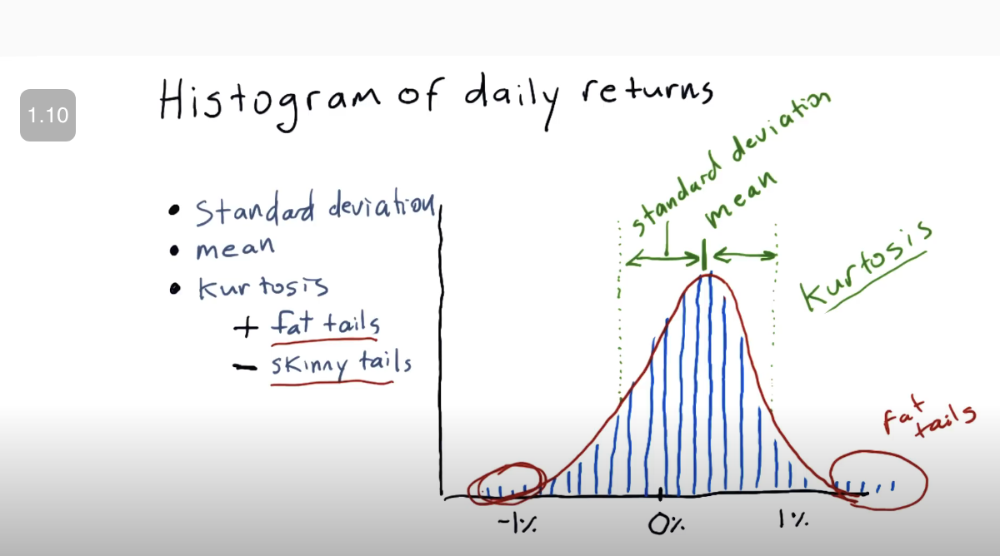
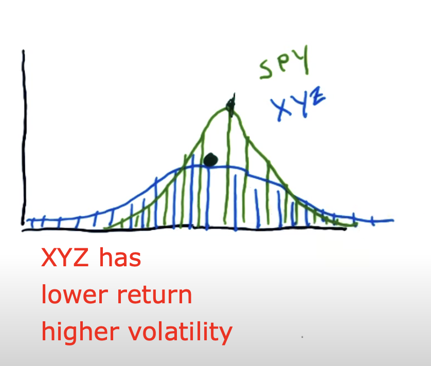
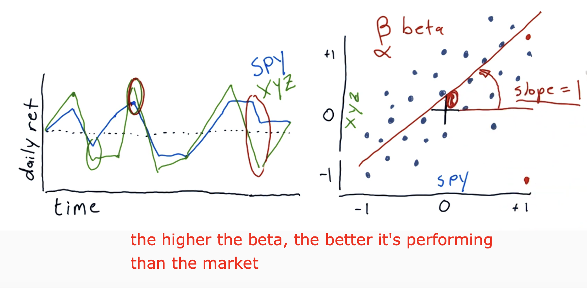

# Histograms and Scatter Plots

This directory demonstrates statistical visualization of stock returns using histograms to analyze distribution characteristics.

## Scripts

### plot-histograms.py
Plots a histogram of SPY daily returns with:
- Mean (white dashed line)
- ±1 standard deviation (red dashed lines)
- **Kurtosis** calculation

### plot-two-histograms.py
Compares two stocks (SPY and XOM) by overlaying their daily return histograms on the same chart.

### utils/stock.py
Utility module with helper functions:
- `get_data()` - Load stock data from CSV
- `plot_data()` - Create matplotlib plots
- `symbol_to_path()` - Convert ticker to file path

## How to Run

1. `cd` into this subdirectory
2. Run `uv sync` to install dependencies
3. Run `uv run plot-histograms.py` or `uv run plot-two-histograms.py`

## Key Concepts

### Kurtosis
**Kurtosis** measures the "tailedness" of a distribution:
- **Positive kurtosis** = fat tails (more extreme events than normal distribution)
- **Negative kurtosis** = thin tails (fewer extreme events)
- **Zero** = normal distribution

### Interpreting Histograms
Comparing two stocks' daily return distributions:
- **Mean** (center) → average return
- **Standard deviation** (width) → volatility
- **Broader distribution** = higher volatility/risk

Example: If XYZ has lower mean than SPY → lower returns; broader shoulders → higher volatility

### Scatter Plots & Linear Regression
When plotting stock returns vs market returns (SPY):

**Beta (slope):**
- Beta = 1 → if market moves 1%, stock moves 1%
- Beta = 2 → if market moves 1%, stock moves 2% (more volatile)
- Beta = 0.5 → if market moves 1%, stock moves 0.5% (less volatile)

**Alpha (y-intercept):**
- Alpha > 0 → stock outperforms the market on average
- Alpha < 0 → stock underperforms the market on average

