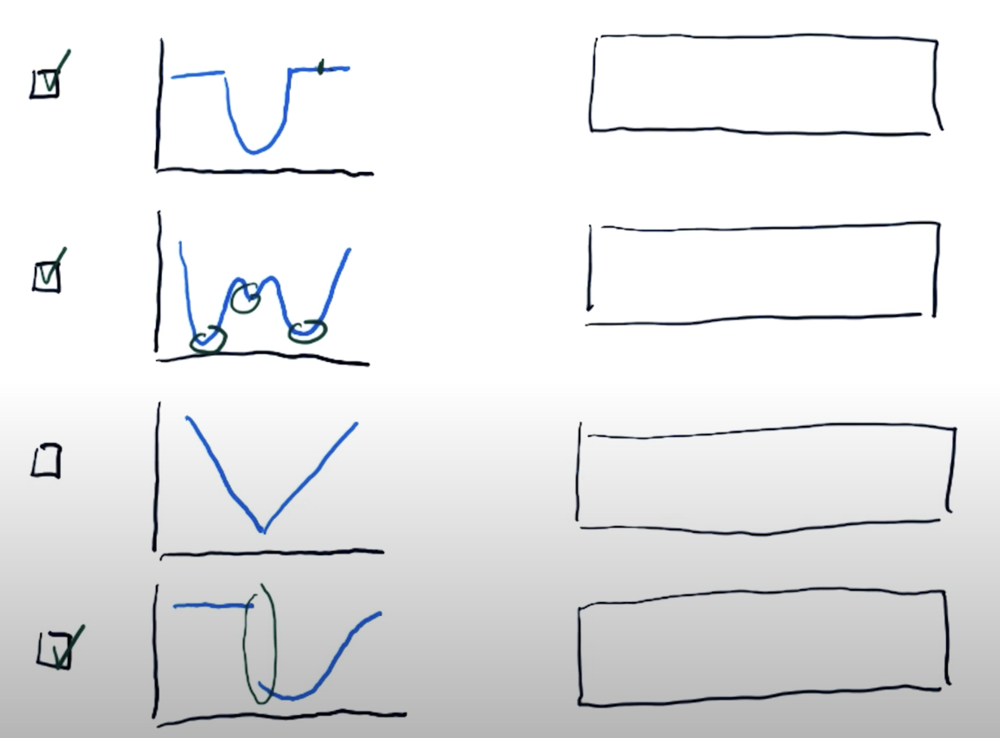
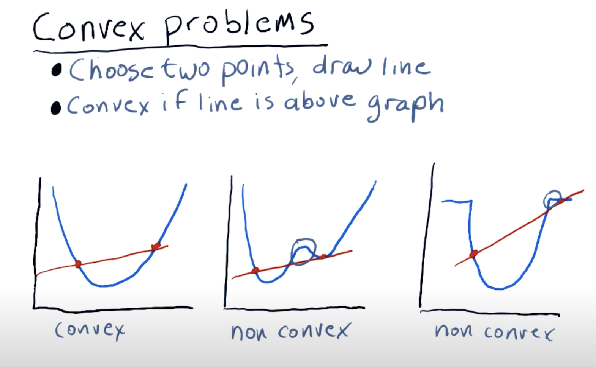

# Optimizers: Building a Parameterized Model

Optimizers are powerful tools for finding optimal solutions in financial modeling. They can:
1. **Find minimum values** of functions (e.g., minimize portfolio risk)
2. **Build parameterized models** based on data (e.g., fit trend lines)
3. **Refine allocations** to stocks in portfolios

## Scripts

### optimizer.py
Demonstrates basic optimization by finding the minimum of a simple function:

$$f(x) = (x - 1.5)^2 + 0.5$$

Uses SciPy's SLSQP (Sequential Least Squares Programming) method starting from an initial guess.

### find-minimizer.py
Fits a line to noisy data points using optimization:
1. Generates data from: $y = 4x + 2$ (with added noise)
2. Uses an **error function** (sum of squared errors) to measure fit quality
3. Minimizes error to find optimal line parameters (slope, intercept)

This demonstrates **linear regression** through optimization.

### find-minimizer-poly.py
Extends line fitting to polynomial regression:
1. Generates data from a 4th-degree polynomial: $y = 1.5x^4 + 10x^3 + 5x^2 + 60x + 50$ (with added noise)
2. Fits a polynomial of specified degree to the data
3. Uses `np.polyval()` to evaluate polynomial predictions

Demonstrates that optimization can fit complex, non-linear relationships to data.

## How to Use an Optimizer

1. **Define a function to minimize**  
   Example: $f(x) = x^2 + 0.5$

2. **Provide an initial guess**  
   Example: $x_0 = 2.0$

3. **Call the optimizer**  
   ```python
   result = spo.minimize(f, x_guess, method='SLSQP')
   ```

## Optimizer Limitations

Optimizers can struggle with functions that have:
- **Flat regions** (zero slope/gradient)
- **Multiple local minima** (may get stuck in local minimum)
- **Discontinuities** (breaks in the function)



## Convex vs Non-Convex Problems

**Convex functions** are ideal for optimization:
- Only **one global minimum** (no local minima)
- Any line between two points lies **above** the curve
- No flat regions
- Guaranteed to find the global optimum

**Non-convex functions** are challenging:
- Multiple local minima
- Optimizer may converge to a suboptimal solution



## Error Metrics

When fitting models to data, we need error metrics:

**Sum of Squared Errors (SSE):**
$$\text{Error} = \sum_{i=1}^{n} (y_i - \hat{y}_i)^2$$

Where:
- $y_i$ = observed value
- $\hat{y}_i$ = predicted value (from model)

SSE is commonly used because:
- It's **convex** (has a single minimum)
- Penalizes large errors more than small ones
- Computationally efficient

## How to Run

1. `cd` into this subdirectory
2. Run `uv sync` to install dependencies
3. Run any script:
   - `uv run optimizer.py` - Basic function minimization
   - `uv run find-minimizer.py` - Linear regression
   - `uv run find-minimizer-poly.py` - Polynomial regression